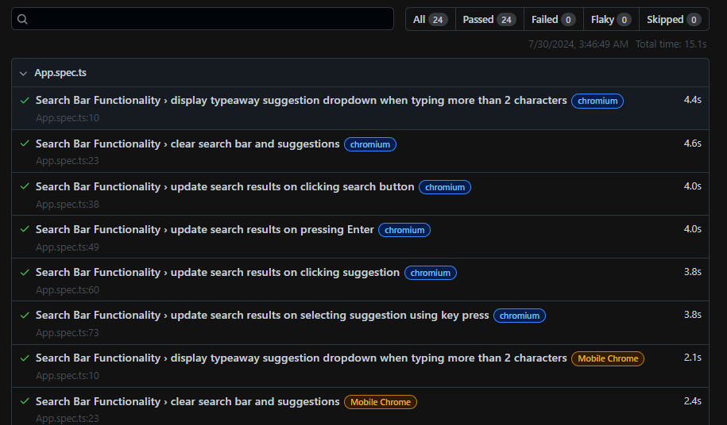
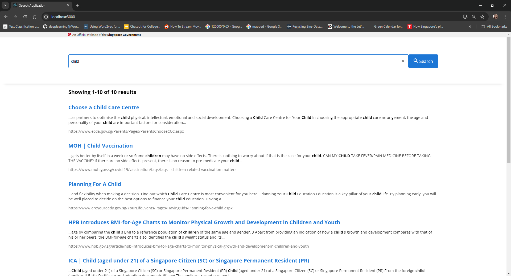

## Setup Instructions

### Prerequisites

Before you begin, ensure you have the following installed on your machine:
- Node.js (version 20.x or compatible) 
- npm (version 10.x or compatible) 

### Installation

1. Clone the repository:

   ```bash
   git clone https://github.com/LilMallory/search-content-assignment.git
   cd search-content-assignment

2. Install the necessary npm modules:

   ```bash
   npm install --legacy-peer-deps

2. Install playwright:

   ```bash
   npx playwright install

### Running the Application

1. To start the application locally, use the following command:

   ```bash
   npm run start
   
This will serve the application on http://localhost:3000. Open your browser and navigate to this URL to see the application running.

### Running Automated Tests

2. Playwright is used for automated testing. The test cases are configured to run in parallel and simulated on different browsers. To run the tests, use the following command:

    ```bash
    npm run test

The script is configured to run without having to serve the application locally. The tests are simulated on Google Chrome, Microsoft Edge, Mobile Chrome, and Chromium.
A html is generated on each run and will automatically be displayed after the test is complete. 



### Screenshot

Below is a screenshot of the search application's user interface:

